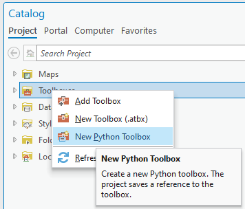
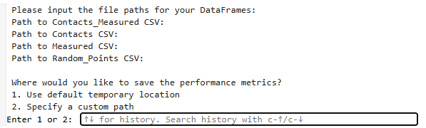

Instructions to use the ArcGis Pro plugin and the python script to determine accuracy.  
=======================================================================================

### **Step 1: Adding the Plugin to ArcGIS Pro**  
 ## Dependencies  
- This tool requires **ArcGIS Pro** (proprietary software) to run.
  
1. Open your ArcGIS Pro project. 
2. In the **Catalog Pane**, **right-click** on **Toolboxes** and select **New Python Toolbox**. 

 

3. **Right-click** on the newly created `.pyt` file and select **Edit**.  
   - A sample Python code will open in your default code editor.  
4. **Overwrite** the sample code with the code from `structural_accuracy_split.pyt`.  
5. Save the file, return to ArcGIS Pro, **right-click** on the toolbox, and select **Refresh**.


### **Input Requirements for the Plugin**  

The plugin requires **6 inputs**:  

1. **Ground Truth - Geology - Mapped**  
   - **Description**: Line geometry file (line features) containing ground-truth lineaments (e.g., vectorized geological maps).  
   - **Location**: Add to the project’s home geodatabase.  

<br>  

2. **Measured - Satellite LiDAR**  
   - **Description**: Line geometry file (line features) containing extracted lineaments (e.g., from satellite/LiDAR data).  
   - **Location**: Add to the project’s home geodatabase.  

<br>  

3. **Clip Area**  
   - **Description**: Polygon geometry file (polygon features) defining the analysis boundary.  

<br>  

4. **Sampling Points**  
   - **Description**: Point geometry layer containing sample points.  
   - **Generation**: Use the **“Create Random Points”** tool in ArcGIS Pro, with the `clip_area` polygon as the **Constraining Feature Class**.  
   - **Note**: Name this file `random_points` and add it to the project’s home geodatabase.  

<br>  

5. **Search Radius (meters)**  
   - **Purpose**: Defines the radius around each sample point to search for ground-truth/measured lineaments.  
   - **Default**: `200 meters`.  

<br>  

6. **Maximum Line Segment Length (meters)**  
   - **Purpose**: Line segments longer than this value will be split into smaller segments.  
   - **Default**: `1000 meters`.
  


### **Output Files**  


After running the script, export these **5 tables** for accuracy assessment:  

1. `Contactos_Vert`  
2. `Measured_Vert`  
3. `Contacts_Measured_Join_Quadrant`  
4. `random_points`  
5. `Measured_Contacts_Join_Quadrant`


---

---

### **Step 2: Calculating Performance Metrics**  
 ## Dependencies 
- Open-source components are licensed under [MIT/Apache/GPL].  
#### **Input Preparation**  
- Use the **first four exported tables** (`Contactos_Vert`, `Measured_Vert`, `Contacts_Measured_Join_Quadrant`, `random_points`) as input for the `accuracy_from_tables_final.py` script.  
- When running the script, **four input windows** will prompt you to select these files.  

---

#### **Required Python Libraries**  
Ensure the following libraries are installed:  
```python
* pandas  
* numpy  
* tkinter  
* csv  
* functools  
* os  
* tempfile  
```  
Install missing libraries using:  
```bash
pip install <library_name>
```

<br>  

<div align="center">
  
</div>  

<br>  

#### **File Path Inputs**  
Provide the **full paths** to the CSV files in the following order:  
1. **Contacts_Measured CSV**: `Contacts_Measured_Join_Quadrant.csv`  
2. **Contacts CSV**: `Contactos_Vert.csv`  
3. **Measured CSV**: `Measured_Vert.csv`  
4. **Random_Points CSV**: `random_points.csv`  

---

#### **Performance Metrics Calculated**  
The script computes:  
- **Accuracy**  
- **Precision**  
- **Recall**  
- **F1 Score**  
- **False Positive Rate (FPR)**  
- **Specificity**  

---

#### **Saving Results**  
Choose one of the following options:  

1. **Default Temporary Location**  
   - Select `Option 1` to save results to a temporary folder.  

2. **Custom Path**  
   - Select `Option 2` to specify a custom path.  
   - **Note**:  
     - Include the `.csv` filename in the path (e.g., `C:/Results/metrics.csv`).  
     - Repeated runs with the same output file will **append** new results to it.  

---

### **Best Practices**  
- Verify CSV file paths before running the script.  
- Use absolute paths for custom locations to avoid errors.  

---
